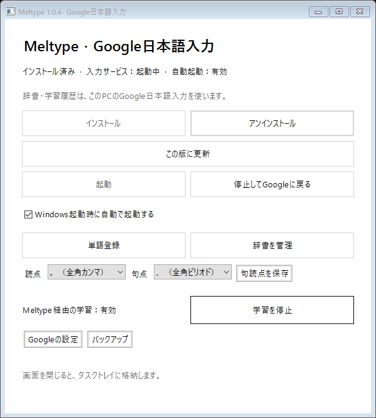

# Meltype Native Google

[雪代／Yukishiro氏のMeltype](https://github.com/yksr-melt/Meltype)を基に、Windowsの入力欄へ未確定文字を表示するIMEと、インストール済みGoogle日本語入力との連携を追加した非公式Forkです。改良は`google-native-ime`ブランチで管理しています。Googleや元作者の公式配布版ではありません。

開発中のソースは本家Meltype 1.1.0の予測候補・日英判定・辞書の改善を取り込んでいます。公開済みNative Google 1.0.5は本家1.0.4ベースです。PC版は`Meltype-Settings.exe`の管理画面からインストール、起動、停止、単語登録、辞書管理を操作できます。

## 管理画面


## できること

Meltypeの日英判別を使い、`kyouhagoogledekensaku`を「今日はgoogleで検索」のように入力できます。日本語の読みが4文字以上になると、Spaceを押す前からGoogleの変換結果で表示を更新します。途中では確定しません。

未確定文字は元の入力欄へ表示し、フォントや色を独自に指定しません。変換候補や予測候補を白い候補画面に表示します。日本語の句読点は既定で全角の「，」「．」。管理画面から変更できます。ローマ字入力の区切りで`zh → ←`、`zj → ↓`、`zk → ↑`、`zl → →`を使えます。

開発版では、入力中の読みや英単語から続きを最大5件表示します。Tab／Shift+Tabで予測を選び、Enterで確定、Escで選択を解除します。Spaceは従来どおりGoogleによる文節変換です。予測用の確定語句はPC内に保存し、学習停止中は追加せず既存履歴を利用します。

Googleの既存辞書・学習履歴を使います。学習が有効なら、確定した日本語を一致確認のうえGoogleにも学習させます。

## インストール

1.0.3ではWindows 10の検索欄への対応を追加します。開発用PCで入力できることを確認しました。[検証状況](docs/NATIVE_SEARCH.md)と[検索対応の通信権限](SECURITY.md#windows検索対応の通信権限)を参照してください。

必要なものはWindows 10／11のx64版と、インストール済みのGoogle日本語入力です。ARM版と32ビット版にはこのパッケージを使わないでください。ランタイムはインストーラーに同梱しているので、Codex・開発環境・別途の.NETインストールは不要です。

1. Google日本語入力をインストールし、一度日本語を入力して動作を確認します。
2. [Native Google 1.0.5 Release](https://github.com/AoneSenbongi/Meltype/releases/tag/native-google-1.0.5)から `Meltype-Native-Google-1.0.5-Setup.exe` を取得し、通常のダブルクリックで開きます。
3. セットアップで保存先とデスクトップショートカットを確認します。必要な管理者確認を承認すると、導入または更新後にIMEが起動します。
4. デスクトップまたはスタートメニューの「Meltypeの管理画面」から、起動・停止・辞書登録などを操作します。

インストール時に、Windowsへのサインイン後の自動起動を設定します。起動時のコンソールは非表示です。自動起動の有効・無効は管理画面から切り替えます。自動更新はありません。従来のMeltype常駐版が動いている場合は、先に終了します。

インストーラーのSHA-256はReleaseの`.sha256`ファイルと比較できます。

```powershell
Get-FileHash .\Meltype-Native-Google-1.0.5-Setup.exe -Algorithm SHA256
```

詳しくは[自分のPCへの導入](docs/NATIVE_IME_TRANSFER.md)を参照してください。Mac版・Linux版のNative Google連携パッケージは配布していません。

## 使い方

入力欄へローマ字で入力します。日本語はライブ変換し、英語と判別した部分は英字で残します。Spaceで変換候補を選び、Enterで確定します。半角／全角キーで日本語入力と英数の直接入力を切り替えます。

管理画面を閉じると、タスクバー右下の通知領域へ格納します。Meltypeの常駐アイコンを右クリックすると「停止してGoogleに戻る」「単語登録」「辞書管理」を直接選べます。単語登録と辞書管理はGoogle日本語入力の画面を開きます。Windows標準の「あ／A」アイコンの右クリックメニューは変更していません。アイコンが見えない場合は通知領域の「隠れているインジケーター」を開いてください。

Google本体でも全角の「，」「．」を使う場合は、Google日本語入力のプロパティで句読点を「，．」に設定します。新しい履歴をGoogleへ追加する場合は、Google側で「学習する」を選んでください。

1.0.5では、管理画面から読点「、／，／,」と句点「。／．／.」を個別に選べます。英語入力は半角のままです。「学習を停止／学習を再開」でMeltype経由の新しい学習を切り替え、既存の辞書・履歴を保持します。通常のGoogle日本語入力を直接使う場合の学習設定は変更しません。[設定の仕様](docs/INPUT_PREFERENCES.md)を参照してください。



## 停止・更新・削除

管理画面の「停止してGoogleに戻る」で通常のGoogle日本語入力へ戻します。登録の削除は「インストール」の隣にある「アンインストール」です。バックアップとGoogleの辞書・学習履歴は残ります。導入済みの場合は、新しいセットアップEXEを実行します。管理画面から従来の配布物を更新する場合は「この版に更新」を押します。DLLが変わる更新では管理者確認が表示され、登録先も更新します。詳しくは[管理画面の説明](docs/NATIVE_GUI.md)を参照してください。

1.0.4ではエラーを日本語で説明し、起動・停止ボタンを現在状態に合わせて無効化します。自動起動はチェックで切り替えます。管理者処理の起動方法も修正しましたが、別PCのインストールエラー解消は未確認です。現在のNative Google 1.0.5には、句読点・疑問符でライブ変換がかなへ戻る問題と、起動待ち時間が短すぎる問題への修正を含めています。古い版からも上記の管理画面で更新でき、個別の修正ZIPを適用する必要はありません。

1.0.5では通信パイプの有無に依存せず起動・停止ボタンを切り替え、状態確認に失敗したときも操作ボタンを無効にします。通信枠を32へ増やし、満杯時に入力サービスを終了せず空きを待ちます。報告された突発停止との因果と長期利用での改善は未確認です。

## Android版

[Android試作版0.2.0のRelease](https://github.com/AoneSenbongi/Meltype-Android/releases/tag/android-prototype-0.2.0)でAPKを公開しています。Android 8.0以降のarm64端末向けです。QWERTYのローマ字入力、日英自動判別、ライブ変換、英語専用モードへの切替を実装しています。フリック入力はありません。

0.2.0では専用アイコンと導入状態の表示を追加し、SimejiのQWERTY配置を参考に英字3段と操作1段へ整理しました。数字・記号は「123」で切り替えます。ライブ変換中も候補を表示し、候補を選ぶと他の文節と英語部分を保って確定します。

AndroidではOSS版MozcとOSS辞書を同梱します。WindowsのGoogle日本語入力やGboardの辞書・学習履歴とは連携しません。エミュレーターでの入力は確認済みですが、実機での入力速度や各アプリとの相性は未確認です。

0.2.0のAPKには本家1.0.3の修正を含めています。試作用の署名が旧版と異なる場合は、旧版を削除してからインストールします。削除ではアプリの学習データも消えます。[導入手順と検証範囲](https://github.com/AoneSenbongi/Meltype/blob/android-prototype/docs/ANDROID_PROTOTYPE.md)を確認して利用してください。

## 検証範囲と制約

WindowsのTSF文書を使った未確定文字・確定・取消の試験、Googleとの接続試験、日英混在と起動待ちの試験を実施しています。登録・有効化と、別のPCでの起動も確認しました。フォント・改行・候補配置は使用するアプリで確認してください。32ビットアプリとストアアプリは未検証です。

Native版では、前後の確定文字の取得やMeltype独自の永続学習をまだ接続していません。元のMeltypeにあるトレイ設定・コードエディター用の判別・ユーザー辞書画面など、一部の機能はNative版で提供していません。

Googleへの接続は非公式IPCを使っています。Googleの更新によって接続できなくなる可能性があります。Google本体のプログラムやシステム辞書は改造・同梱していません。

Windows 10の検索欄では、1.0.3の開発用PCで日本語を入力できることを確認しました。Windows 11の検索欄と一般のストアアプリは未確認です。動作しない入力先ではWin＋SpaceでGoogle日本語入力へ切り替えてください。検証範囲は[通常Releaseの説明](docs/NATIVE_RELEASE.md)に記載しています。

不具合を報告する際は、アプリ名、入力した操作、期待した動作、実際の動作を記載してください。起動失敗時は画面のメッセージと、`experimental-build`内の`native-broker-errors.txt`・`native-broker-output.txt`も確認できます。

## プライバシー

入力の判別とGoogleへの変換要求はPC内で処理します。入力文字をネットワークへ送信する処理は追加していません。ZIPには個人の設定・辞書・学習履歴を含めず、導入先のGoogleのデータを使います。登録時のバックアップは展開先の`backups`へ保存します。

PC版の権限、学習データの保存と削除、ログ、パスワード欄の制約、署名と脆弱性の報告先は[このForkのセキュリティ説明](SECURITY.md)を確認してください。バックアップには個人の辞書・学習情報が含まれるため、公開しないでください。

## 元のMeltypeとライセンス

日英判別と入力処理は、元のMeltypeの成果を基にしています。元作者と協力者への謝意を含む[元のREADME](README.UPSTREAM.md)を保存しています。この文書は元の常駐版の説明であり、上記のNative版の導入手順とは異なります。

[lnkiai氏のIME化Fork](https://github.com/lnkiai/Meltype/releases/tag/ime-1.0.1-2)の入力スコープ保護と通信先確認を参考にし、Google連携用のNative実装へ反映しています。参考にした実装の著作権とGPL表記をコード内に記載しています。

MeltypeとこのForkの改良は[GNU GPL](LICENSE)に従って公開しています。配布ZIPには対応するソースを同梱しています。同梱ランタイムのライセンスと第三者の通知は、ZIP内の`runtime/LICENSE.txt`と`runtime/ThirdPartyNotices.txt`を参照してください。

```text
Meltype
Copyright (C) 2026 雪代 / Yukishiro (@yksr_melt / @yksr-melt)

This program is free software: you can redistribute it and/or modify it under the terms of the
GNU General Public License as published by the Free Software Foundation, either version 3 of the
License, or (at your option) any later version.

This program is distributed in the hope that it will be useful, but WITHOUT ANY WARRANTY; without
even the implied warranty of MERCHANTABILITY or FITNESS FOR A PARTICULAR PURPOSE. See the GNU
General Public License for more details.
```

ソースからのビルドは[Native版の構成と手順](docs/NATIVE_IME_SETUP.md)、Googleとの接続方式は[Google連携の説明](docs/GOOGLE_IME_EXPERIMENT.md)を参照してください。

## 本家1.0.4の取り込み

本家v1.0.4までの共通入力コアとテストを取り込みました。拡張ローマ字表記と日英・かなキーの判定改善を含みます。Qtアプリ向けの貼り付け修正は常駐版のソースに含みますが、Native Google版はTSFで入力し、貼り付け経路を追加していません。Windows常駐版、Mac・Linux向けの変更もソースに含みます。Native Google版は独自のTSF入力・管理画面を使うため、本家の入力画面や設定画面の変更は直接反映されません。選択済み文字の再変換は本家アプリ側の実装を含みますが、Native IME側では未対応です。

ウイルス対策による脅威検出はSmartScreenの未署名警告とは別です。定義を更新し、配布物を再取得して再検査してください。引き続き検出される場合は保護を無効にせず、個人情報を伏せて検出名と版をこのForkのIssuesへ報告してください。

## セットアップ版

1.0.5はEXEインストーラーで導入します。デスクトップショートカットは既定で作成し、不要ならセットアップで解除できます。Windowsのアプリ一覧から削除でき、IME登録の解除に失敗した場合はファイルを残します。Googleの辞書・学習履歴とバックアップは削除しません。旧ZIP版からの更新では既存の導入先を維持するため、旧フォルダーも保持してください。[セットアップの仕様](docs/NATIVE_INSTALLER.md)を参照してください。
